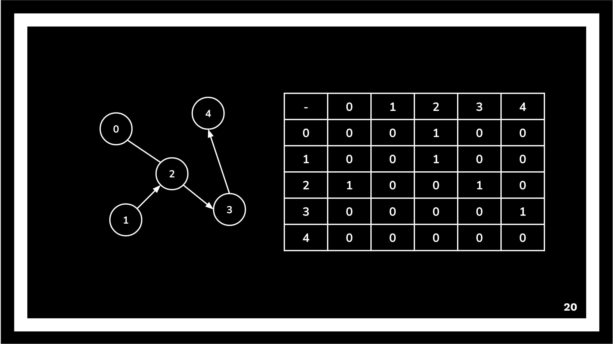
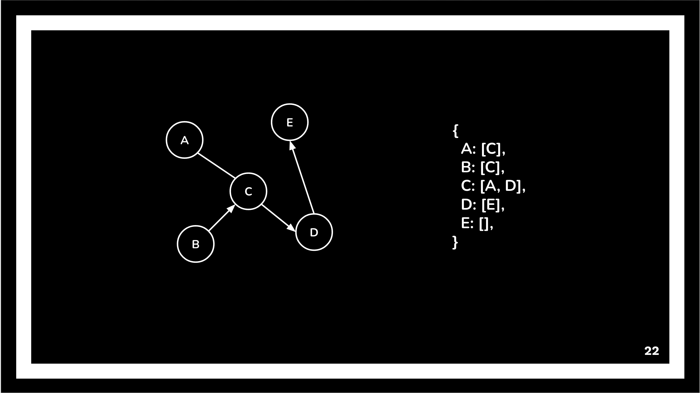

# nyc_coders
Material covered during nyc coders DSA. Image examples from slides provided by NYC coders

## Intro to Graphs 3/14

### Graphs intro
Data points in a graph are known as a vertex (similar to a node in a tree or linked list) and the links are known as edges (tree is a subtype of graph with defined behaviors). Unlike a linked list or tree there is no start point, in a graph any vertex can be a start point. In a graph the edge can also store data.    

### Deeper Dive

* A non linear data structure made up of a finite set of vertices connects by a set of edges. 

* Graphs can be directed or undirected

* Edges can have a weight, which can denote things like correlation, or other data

* Degree of a vertex for an undirected graph is the amount of connections that vertex has 

* For directed graphs you would have in degrees and out degrees depending on which way the edges point. 

## Representations

* Edge List 
* Adjacency Matrix 
* Adjacency List

### Edge List
* Can be represented as follows: 
    [
        [A, B], 
        [B, C],
        [C, A]
    ] (order here is not necessarily relevant)

* Weighted edge lists would be represented with three values within the sub arrays, with the third value representing the weight. 

### Adjacency Matrix 
* A matrix is used to represent exactly which vertices have edges between them.
* The numbers used are:
    * 0: an edge doesn’t exist
    * 1: an edge exists
* O(1) edge lookup, insertion, and removal.
* O(V2) space so it’s mainly used for dense graphs.

### Adjacency List
* A hash map is used to store nodes.
    * Key: a vertex.
    * Value: list of outgoing edges from a vertex.
* Space efficient for representing sparse graphs.
* An array can be used instead of a hash map if the vertices are ordered numbers.
* The list can be an array, linked list, or doubly linked list.

A points to C, B points to C, C points to A and D, D points to E, E points to nothing. Represented as:  
    <ul>
    { 
        A: [C], 
        B: [C], 
        C: [A, D], 
        D: [E], 
        E: [] 
    } 
    </ul>

